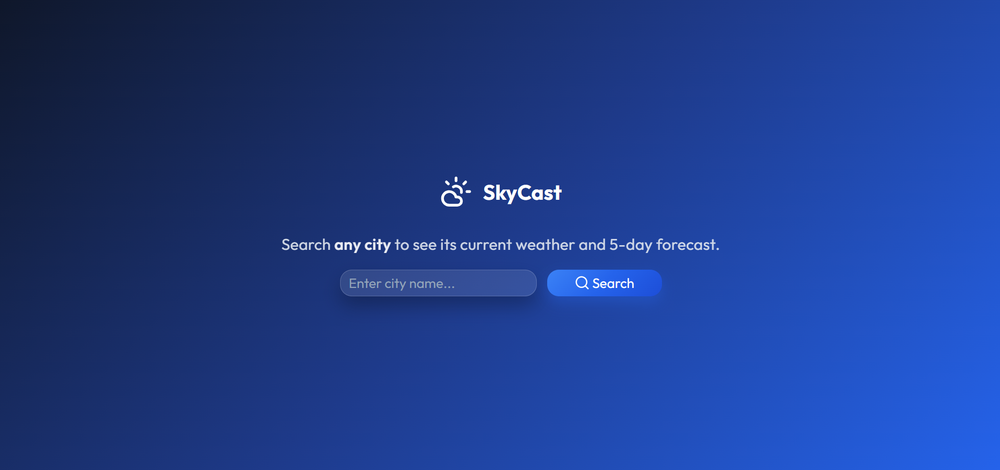
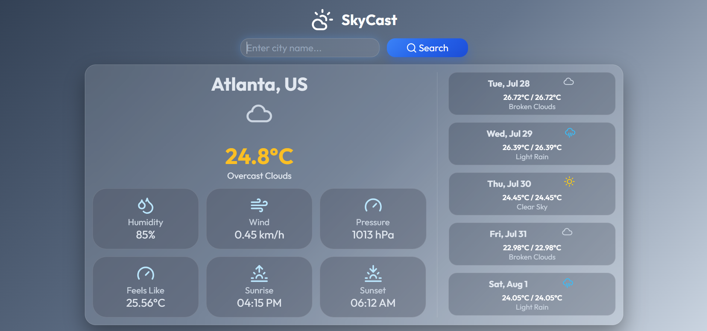
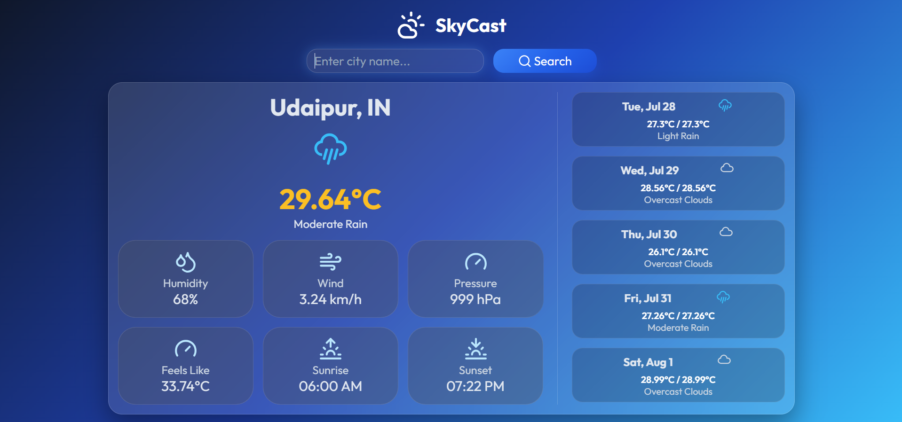

# 🌤️ SkyCast

A modern and responsive weather application built with **React.js** that provides real-time weather information and a 5-day forecast for any city worldwide. SkyCast features a clean user interface, smooth user experience, and dynamic weather data powered by the OpenWeather API.


---

## 🚀 Live Demo

👉 **Try SkyCast here:** https://skycast-yash-weather.vercel.app/

---

## 📸 Preview

### Home Screen


### Weather Dashboard




---

## ✨ Features

- 🌍 Search weather for any city worldwide
- 🌡️ View real-time weather conditions
- 📅 5-day weather forecast
- 🌤️ Weather icons based on current conditions
- ⚡ Fast and responsive user interface
- 📱 Fully responsive design for desktop, tablet, and mobile
- ⏳ Loading spinner while fetching weather data
- ❌ User-friendly error handling for invalid cities or network issues
- 🎨 Modern UI with reusable React components

---

## 🛠️ Built With

- React.js
- Vite
- CSS3
- JavaScript (ES6+)
- OpenWeather API
- Lucide React Icons

---

## 📂 Project Structure

```
src/
│
├── components/
│   ├── CurrentWeather.jsx
│   ├── ForecastWeather.jsx
│   ├── Logo.jsx
│   ├── SearchBar.jsx
│   ├── WeatherDashboard.jsx
│   └── WelcomeMessage.jsx
│
├── App.jsx
├── main.jsx
└── index.css
```

---

## 🚀 Installation

### Clone the repository

```bash
git clone https://github.com/codewithyashsoni/SkyCast.git
```

### Navigate to the project

```bash
cd SkyCast
```

### Install dependencies

```bash
npm install
```

### Create an environment file

Create a `.env` file in the project root and add:

```env
VITE_OPENWEATHER_API_KEY=your_api_key_here
```

### Start the development server

```bash
npm run dev
```

---

## 🌐 Deployment

To create a production build:

```bash
npm run build
```

The application can be deployed on platforms such as:

- Vercel
- Netlify
- GitHub Pages

---

## 💡 Future Improvements

- 📍 Detect user's current location
- 🌅 Dynamic backgrounds based on weather conditions
- 🌙 Dark/Light mode
- 🕒 Hourly weather forecast
- ⭐ Save favorite cities
- 🌎 Recent search history
- 🌡️ Toggle between Celsius and Fahrenheit

---

## 🤝 Contributing

Contributions, issues, and feature requests are welcome.

If you'd like to improve the project, feel free to fork the repository and submit a pull request.

---

## 👨‍💻 Author

**Yash Soni**

- GitHub: https://github.com/codewithyashsoni

---

## ⭐ Show Your Support

If you found this project helpful, consider giving it a ⭐ on GitHub!